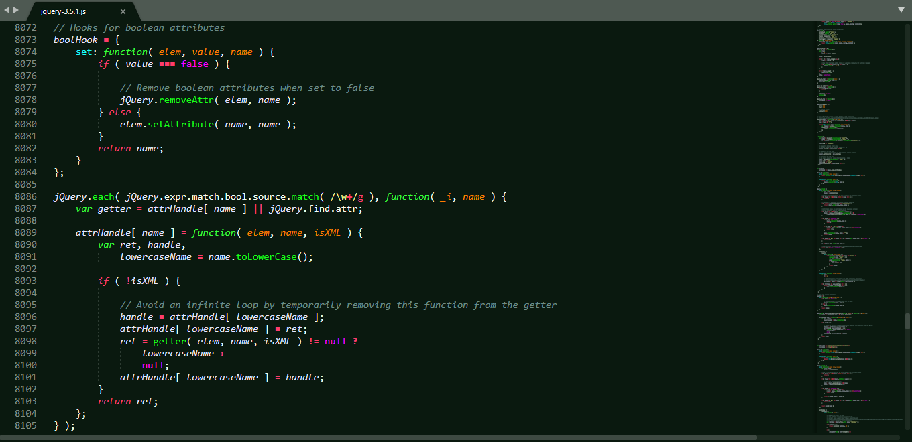

# DarkDonut Color Scheme

> A Dark Color Scheme for FOREST CODERS who love green for [Sublime Text](https://sublimetext.com)

### Installation
You can install the theme and keep up to date by cloning the repo directly into your **Packages** directory in the Sublime Text application settings area.

You can locate your Sublime Text Packages directory by using the menu item Preferences -> Browse Packages....

While inside the Packages directory, clone the theme repository using the command below:

    git clone https://github.com/DarkDonut-theme/DarkDonut_Strawberry_color_scheme.git

### Activating theme
Go to **Preferences => Color Scheme => User** and then select the **DarkDonut Forest Coders**
