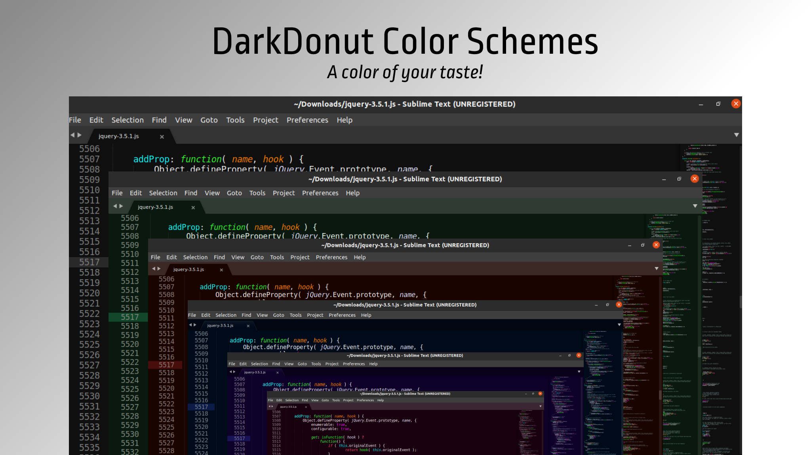
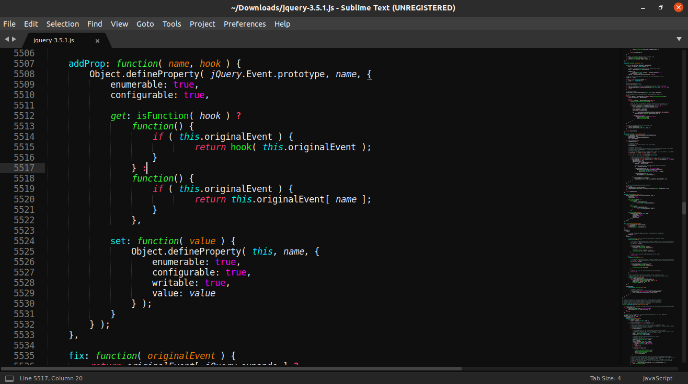
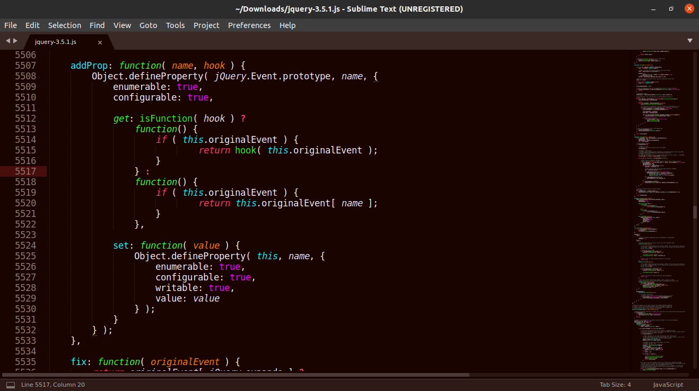
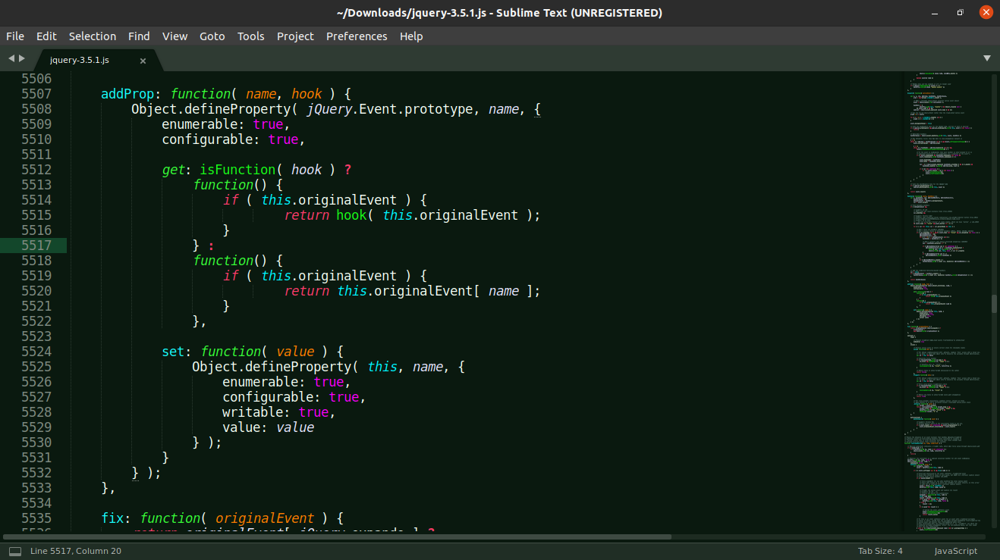
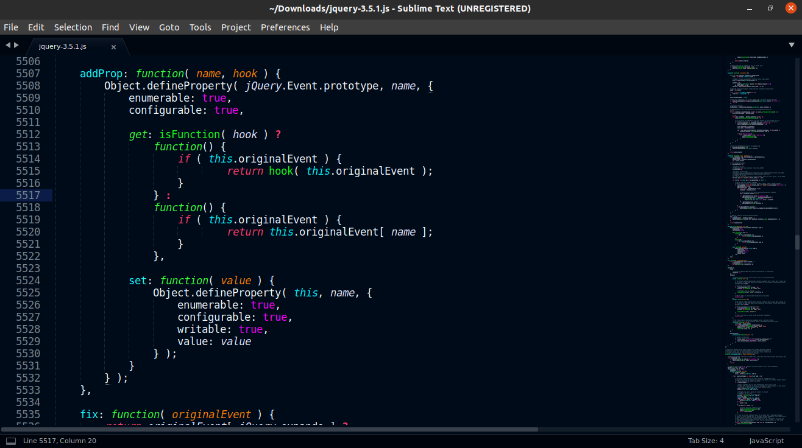
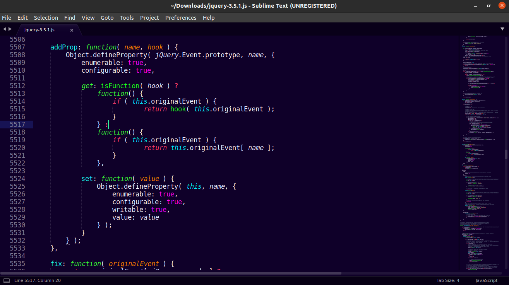
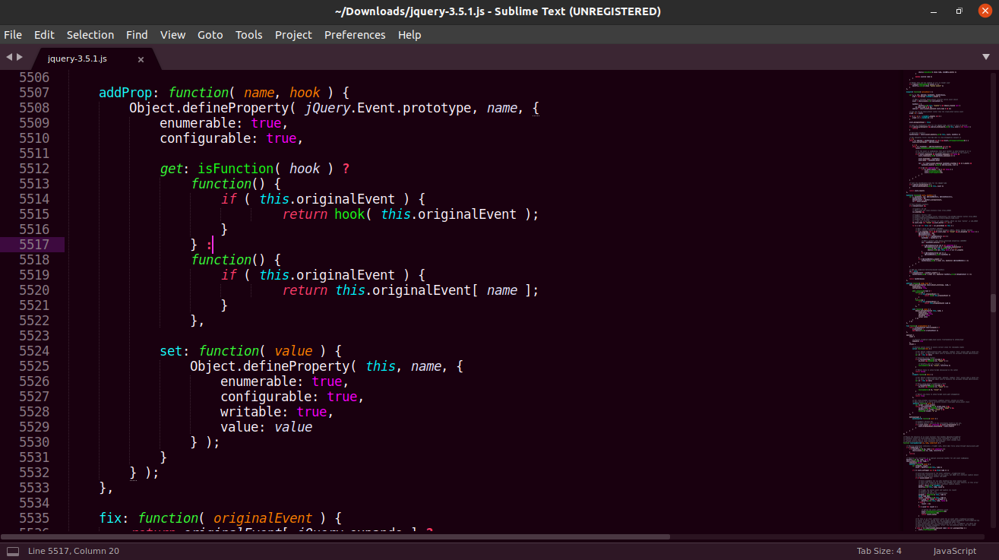

# DarkDonut Color Scheme

> A set of Color Schemes for [Sublime Text](https://sublimetext.com) that fits your flavour

### DarkDonut Space Coders 🚀 (Black)

### DarkDonut Volcanic Coders 🔥 (Reddish-orange)

### DarkDonut Forest Coders 🌲 (Green)

### DarkDonut Marine Coders 🐋 (Blue)

### DarkDonut Purple Coral Coders 🟣 (Purple)

### DarkDonut Pink Spring Coders 🌸 (Pink)

## Installation
If you are using **Package Control**, you can easily install **DarkDonut Color Schemes** via the Package Control: Install Package menu item.
This Color Scheme package is listed as DarkDonut Color Schemes in the packages list.

## Activating theme
Go to **Preferences => Color Scheme** and then select the **DarkDonut Color Schemes**
